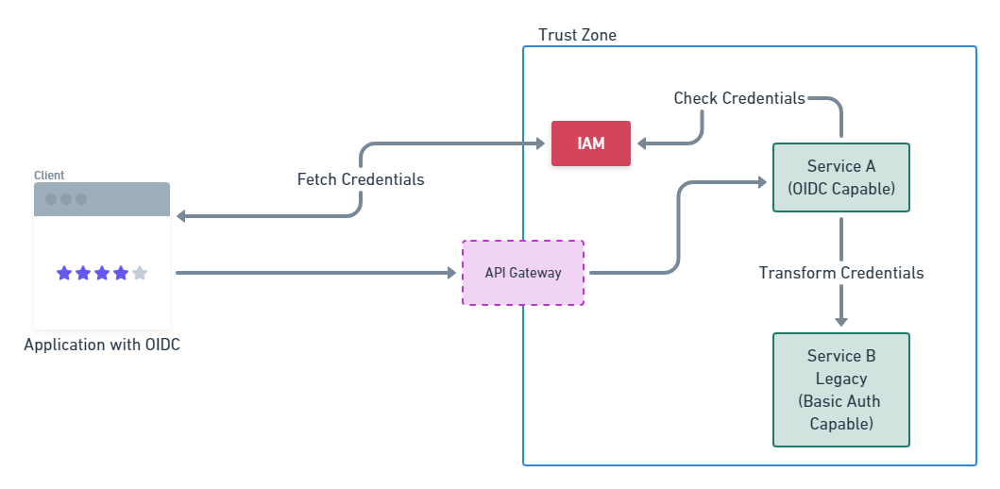
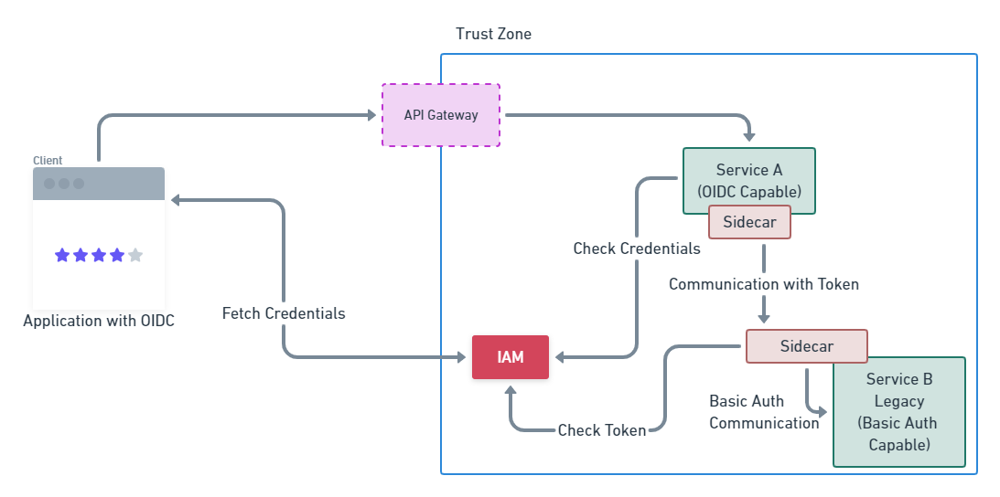

# State of the Art and the Practice

Modern cloud environments solve some problems, but they also introduce
new ones. Topics like “Data Transfer” or “Service Discovery” are solved
by now. Technologies like "Kubernetes"^[<https://kubernetes.io/>] enable
engineers to deploy their applications fast and with confidence.

But to enable a multi-service-software to communicate with
other applications without code changes is an unsolved problem.
The issue is that with the multitude of authentication schemes and
methods, each service must know all techniques of their communication
partners. This required changes to the code to enable certain communication
which may introduce new bugs.

# Deficiencies

To communicate between various services with their authentication methods,
changes need to be introduced into the software to enable the communication
and general transformation of credentials. The following scenario should
shed light upon the problem.

{#fig:is_situation}

As seen in @fig:is_situation, a modern client application that supports
OIDC^[<https://openid.net/connect/>] communicates with the IAM
(identity access management) and fetches an access token to connect
to "Service A". The connection is routed into a trusted zone through
a gateway (e.g. Envoy, Ambassador, Nginx). In this scenario, "Service A"
is a modern application that supports OIDC and therefore checks the
provided credentials (the access token of the client) with the IAM.
If the credentials are valid, the client is allowed to access the service.

The shown software construct contains a legacy service, that was not
refactored nor rewritten, but deployed into the same trust zone. The
legacy service only understands Basic Auth as an authentication method.
If "Service A" wants to communicate with "Service B", it must translate
the credentials from the client (or some sort of "Service Account")
into valid basic auth credentials that "Service B" understands.

For the given scenario, changing "Service A" to be able to provide
basic auth credentials to "Service B" is practiable, but with
a big service landscape at hand, this will be error prone work
and does not scale well^[Matrix Problem: X Service * Y Authentication
Protocols].

\newpage

# Project Goals

To mitigate the problem stated above, the primary goal of Master
Thesis in general is to provide a solution to enable this kind of
transformation in a declarative way.

{#fig:should_situation}

The goal of this project is to provide a solution stated in
{@fig:should_situation}. The figure should give a grasp of a solution
but the pattern may change during the work. An initial idea is
to provide a sidecar pattern^[<https://docs.microsoft.com/en-us/azure/architecture/patterns/sidecar>]
that knows how to transform credentials so that their partner-services
understand them. "Service A" would communicate with the sidecar of
"Service B" and transfer the access token of the client as it would
with any other OIDC application. The sidecar of "Service B" will then
check if the access token is valid and allowed to access the service
and finally transforms the credentials to valid basic auth.

\newpage

# Deliverables and Critical Success Factors

The following elements are delivered:

- Analysis of actual work into the topic
- Softwarearchitecture of the proposed solution
- Proof of concept of the given scenario in @fig:should_situation
- OpenSource repository with the solution (PoC state)

Additionally, a tutorial into the sidecar pattern is published
onto a to be defined platform to provide reading material into
the topic.

A critical factor in the project is the generalization of the solution.
The solution must be pluggable/modularized to add additional authentication
mechanisms.
